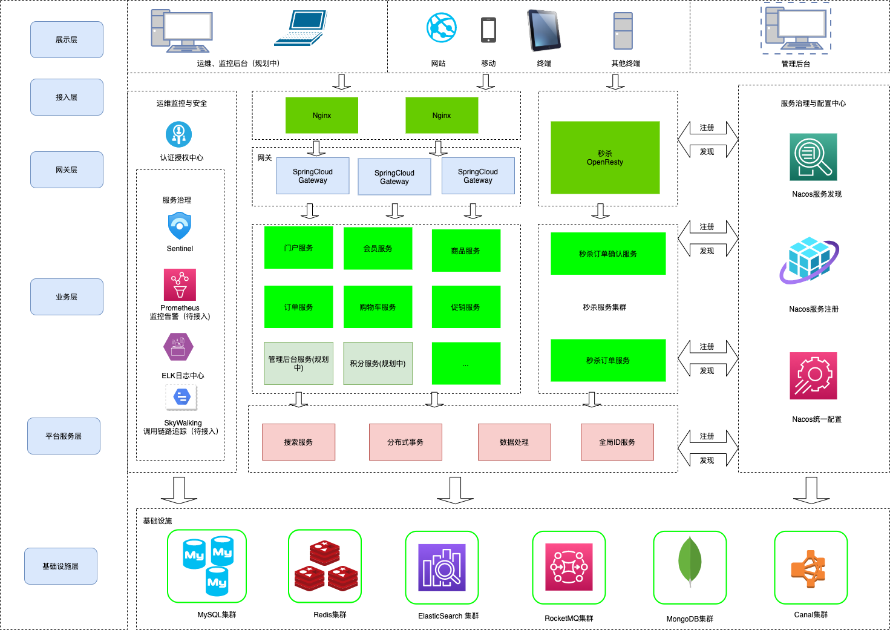

## gw商城是什么
---
gw商城(英文全称GWMALL)是一个基于SpringBoot,Spring Cloud,Spring Alibaba的微服务商城，实现了电商基本的功能：**电商门户页面**、**用户登录功能**、**商品搜索功能**、**购物车功能**、**下单功能**、**支付功能（支付宝沙箱）**

## gw商城系统微服务基本架构
---

  

## gw商城后端基本组件和技术栈
---
1. Spring和微服务组件:SpringSecurity + OAuth2.0 、SpringBoot、Spring Cloud Gateway、Spring Alibaba Cloud、Nacos、 Sentinel
2. 分布式事务组件：Seata
3. 分库分表组件: ShardingJDBC
4. 缓存组件: Redis、Caffine(JVM级)、Canal
5. ELK组件: ElasticSearch(用于搜索，日志上报),logstash、filebeat
6. 数据库：MySQL、MongoDB用于存储历史订单数据
7. 反向代理: OpenResty(用于秒杀，提供限流、验证码功能等)
8. 其他开源组件与技术: 美团leaf算法（分布式ID生成）、JWT、
9. MQ组件： RocketMQ(异步下单)
## gw商城模块划分
---
gw商城微服务模块主要分为:
* **认证中心(gw-authcenter)**: 认证中心接入**Spring Security OAtuh2**主统一负责用户登录验证、提供JWT公钥服务
* **门户服务(gw-portal)**: 门户网站提供首页商品展示、推荐商品、商品分类、分类专题、商品评论功能
* **网关服务(gw-gateway)**： 网关服务作为商城流量的入口，负责请求的转发、负载均衡和请求的认证，网关接入了限流组件Sentinel，支持按照各种规则限流
* **购物车服务(gw-cart)**: 不多说，购物车支持商品添加、移除和查询操作
* **会员服务(gw-member)**: 会员注册功能、登录功能、修改密码、手机验证码、图片验证码、刷新token、个人信息获取和修改、收获地址管理等
* **订单服务(gw-order)**: 订单服务又分为**当前订单服务** 和 **历史订单服务**, 一般订单表较大，做了分库分表后，需要把创建时间较长的订单数据迁移到MongoDB，历史订单服务正是做订单和订单详情迁移功能
    * **当前订单服务(gw-order-current)**: 对订单进行了分库分表，提供订单、支付和退货的基本功能
        1. 用户订单功能： 用户创建订单、用户订单查询、查询订单、获取订单详情、修改收货人信息、备注订单、订单设置管理、获取订单ID(用于创建订单实现接口幂等性)、
        2. 管理员订单功能：查询订单、批量关闭、批量删除、订单详情管理、收货人信息修改、订单费用修改、订单备注
        2. 订单支付功能：支付（支付宝沙箱）、支付状态查询、支付成功回调
        3. 退货管理：退货申请，退货申请增删查、退货原因管理
    * **历史订单管理(gw-order-history)**: 订单迁移管理功能，支持把历史订单迁移到MongoDB，历史订单按时间段查询(暂未实现)
* **商品服务(gw-product)**: 
    * **商品管理** 商品服务提供商品详情接口、推荐品牌信息接口、批量获取商品详情接口、秒杀活动专场列表、获取日期活动场次、首页秒杀商品列表
    * **库存管理** 提供库存管理接口:库存增加、扣减、库存锁定、库存还原（供其他微服务调用）

* **促销系统(gw-promotion)**:
    * **推荐商品管理**:负责首页推荐商品管理，
    * **优惠券管理**:优惠券领取，用户优惠券列表，用户优惠券列表功能，购物车可用优惠券列表
    * **秒杀管理**：秒杀开启，秒杀商品获取，秒杀库存查询、扣减等
* **搜索服务(gw-search)**:  
     基于elastic-search实现，支持批量商品上传，商品聚合搜索功能,接入MQ监控商品信息变化，实时上传商品信息到es服务（一般和**gw-canal**模块使用）
* **分布式ID生成服务（gw-uniqid）**： 
    接入美团开源的leaf算法生成分布式唯一ID服务，基于MySQL生成唯一ID，在原来功能基础上增加了批量生成ID接口，减少网络IO次数，提高效率,主要用于订单ID和订单详情ID生成服务，由于可观的QPS，也可提供其他需要生成的唯一ID的微服务使用

* **秒杀服务（gw-seckill）**: 一般来说，秒杀服务有自己独立的数据库、redis和其他中间件，避免促销期间瞬时的超高并发量影响正常的商城系统
    * **秒杀购物车服务（sekill-cart）**: 专用于秒杀的购物车，做了功能瘦身，和常规购物车服务分开独立部署，提供订单确认页面接口，验证码接口（用于**限流**），检查验证码接口（高并发场景下，为了避免验证码服务成为性能瓶颈，也可以拆分**验证码微服务**）
    * **秒杀订单服务（seckill-order）**: 专用于秒杀的订单微服务，生成秒杀订单接口，查询秒杀订单是否生成,针对秒杀高并发下单场景做了相关优化：商品存放在缓存中，缓存中库存扣减，MQ异步下单，延迟取消订单，进程级缓存售罄标记（**拦截掉无效请求**），利用**WAL**机制使用RocksDB快速持久化订单数据到本地磁盘（针对redis扣减库存的场景，存在Redis宕机和本服务同时宕机的可能，这样可能导致库存扣减记录丢失，最终导致**超卖**（超卖是不允许的））
* **Canal服务（gw-canal）**: gw-canal服务依赖**Alibaba组件Canal**,主要用于微服务商品缓存的异步刷新（缓存设计的**Cache Aside**模式），布隆过滤器更新（新增商品的场景），实时上报商品到ES服务（商品新增、更新的场景），秒杀活动开启服务（加载商品到缓存）,首页推荐品牌、新上架商品、人气商品信息的缓存更新