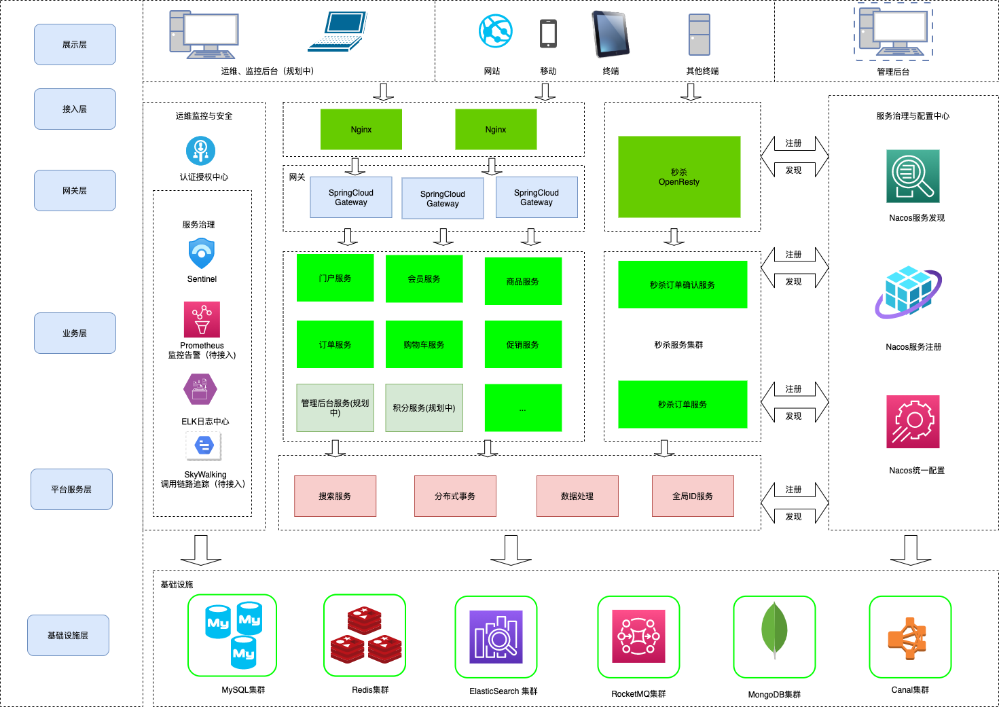
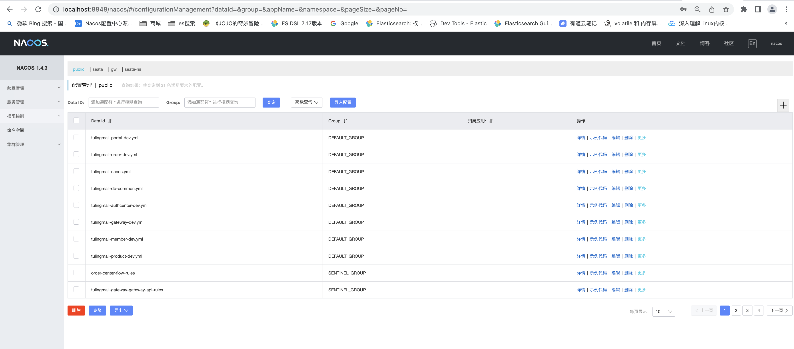
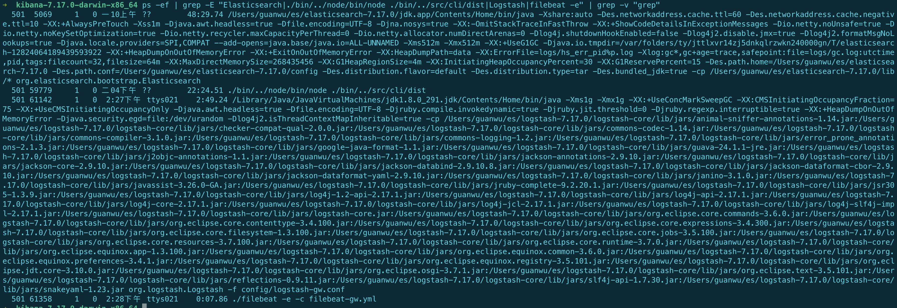
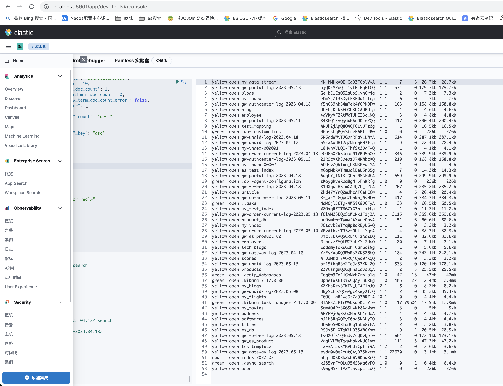
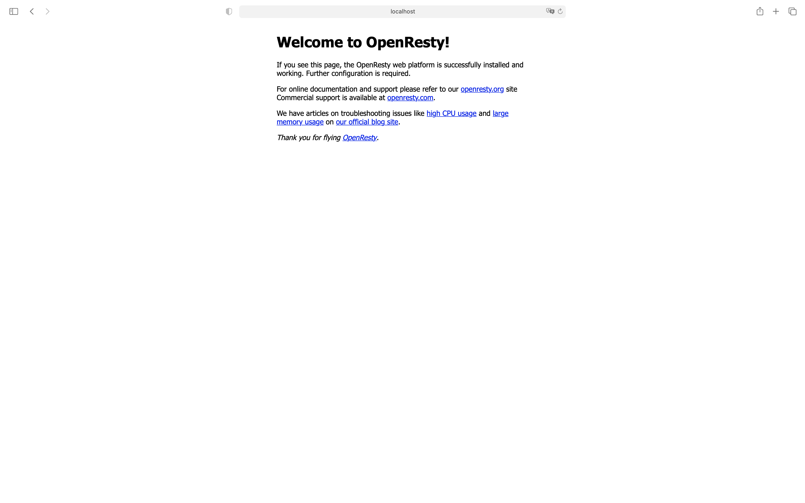
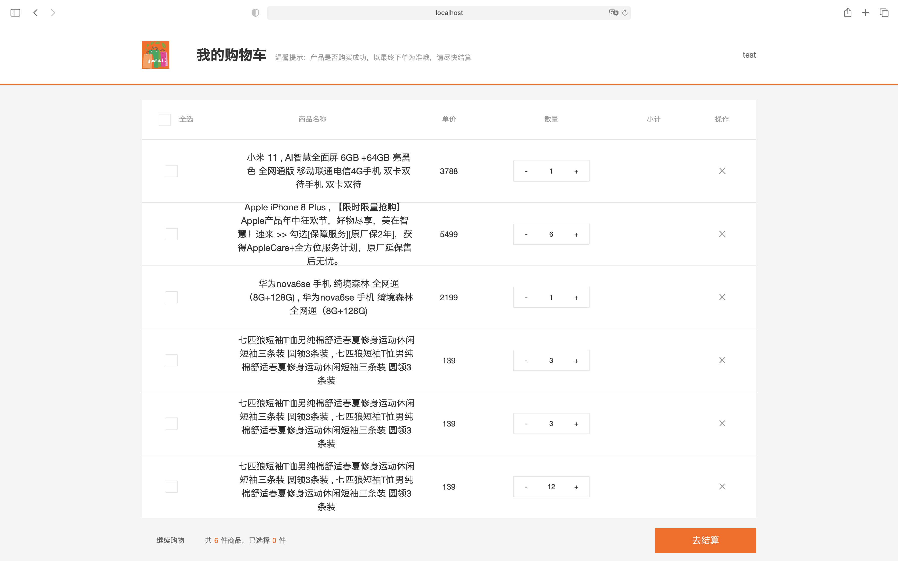
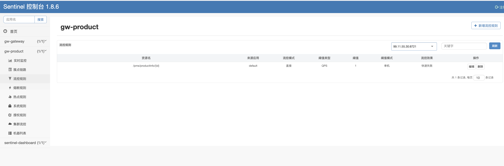
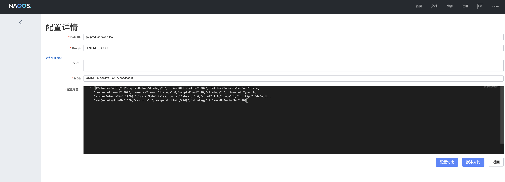
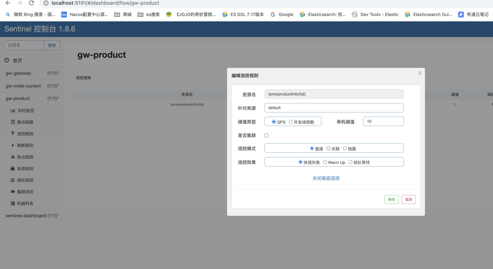
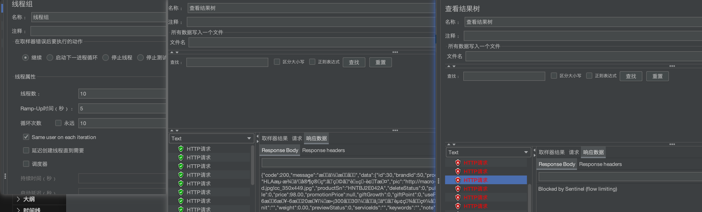

<div  id="imgdiv" style="height:200px;
        width:100%;
        top: -60px;
        display: flex;
        justify-content:center;
        align-items:center;">

</div>

## gw商城是什么
---
gw商城(英文全称GWMALL)是一个基于SpringBoot,Spring Cloud,Spring Alibaba的微服务商城，实现了电商基本的功能：**电商门户页面**、**用户登录功能**、**商品搜索功能**、**购物车功能**、**下单功能**、**支付功能（支付宝沙箱）**

## gw商城系统基本架构
---

  

## gw商城后端基本组件和技术栈
---
1. Spring和微服务组件:SpringSecurity + OAuth2.0 、SpringBoot、Spring Cloud Gateway、Spring Alibaba Cloud、Nacos、 Sentinel
2. 分布式事务组件：Seata
3. 分库分表组件: ShardingJDBC
4. 缓存组件: Redis、Caffine(JVM级)、Canal
5. ELK组件: ElasticSearch(用于搜索，日志上报),logstash、filebeat
6. 数据库：MySQL、MongoDB用于存储历史订单数据
7. 反向代理: OpenResty(用于秒杀，提供限流、验证码功能等)
8. 其他开源组件与技术: 美团leaf算法（分布式ID生成）、JWT、
9. MQ组件： RocketMQ(异步下单)
## gw商城模块划分
---
gw商城微服务模块主要分为:
* **认证中心(gw-authcenter)**: 认证中心接入**Spring Security OAtuh2**主统一负责用户登录验证、提供JWT公钥服务
* **门户服务(gw-portal)**: 门户网站提供首页商品展示、推荐商品、商品分类、分类专题、商品评论功能
* **网关服务(gw-gateway)**： 网关服务作为商城流量的入口，负责请求的转发、负载均衡和请求的认证，网关接入了限流组件Sentinel，支持按照各种规则限流
* **购物车服务(gw-cart)**: 不多说，购物车支持商品添加、移除和查询操作
* **会员服务(gw-member)**: 会员注册功能、登录功能、修改密码、手机验证码、图片验证码、刷新token、个人信息获取和修改、收获地址管理等
* **订单服务(gw-order)**: 订单服务又分为**当前订单服务** 和 **历史订单服务**, 一般订单表较大，做了分库分表后，需要把创建时间较长的订单数据迁移到MongoDB，历史订单服务正是做订单和订单详情迁移功能
    * **当前订单服务(gw-order-current)**: 对订单进行了分库分表，提供订单、支付和退货的基本功能
        1. 用户订单功能： 用户创建订单、用户订单查询、查询订单、获取订单详情、修改收货人信息、备注订单、订单设置管理、获取订单ID(用于创建订单实现接口幂等性)、
        2. 管理员订单功能：查询订单、批量关闭、批量删除、订单详情管理、收货人信息修改、订单费用修改、订单备注
        2. 订单支付功能：支付（支付宝沙箱）、支付状态查询、支付成功回调
        3. 退货管理：退货申请，退货申请增删查、退货原因管理
    * **历史订单管理(gw-order-history)**: 订单迁移管理功能，支持把历史订单迁移到MongoDB，历史订单按时间段查询(暂未实现)
* **商品服务(gw-product)**: 
    * **商品管理** 商品服务提供商品详情接口、推荐品牌信息接口、批量获取商品详情接口、秒杀活动专场列表、获取日期活动场次、首页秒杀商品列表
    * **库存管理** 提供库存管理接口:库存增加、扣减、库存锁定、库存还原（供其他微服务调用）

* **促销系统(gw-promotion)**:
    * **推荐商品管理**:负责首页推荐商品管理，
    * **优惠券管理**:优惠券领取，用户优惠券列表，用户优惠券列表功能，购物车可用优惠券列表
    * **秒杀管理**：秒杀开启，秒杀商品获取，秒杀库存查询、扣减等
* **搜索服务(gw-search)**: <br>
     基于elastic-search实现，支持批量商品上传，商品聚合搜索功能,接入MQ监控商品信息变化，实时上传商品信息到es服务（一般和**gw-canal**模块使用）
* **分布式ID生成服务（gw-uniqid）**：<br>
    接入美团开源的leaf算法生成分布式唯一ID服务，基于MySQL生成唯一ID，在原来功能基础上增加了批量生成ID接口，减少网络IO次数，提高效率,主要用于订单ID和订单详情ID生成服务，由于可观的QPS，也可提供其他需要生成的唯一ID的微服务使用

* **秒杀服务（gw-seckill）**: 一般来说，秒杀服务有自己独立的数据库、redis和其他中间件，避免促销期间瞬时的超高并发量影响正常的商城系统
    * **秒杀购物车服务（sekill-cart）**: 专用于秒杀的购物车，做了功能瘦身，和常规购物车服务分开独立部署，提供订单确认页面接口，验证码接口（用于**限流**），检查验证码接口（高并发场景下，为了避免验证码服务成为性能瓶颈，也可以拆分**验证码微服务**）
    * **秒杀订单服务（seckill-order）**: 专用于秒杀的订单微服务，生成秒杀订单接口，查询秒杀订单是否生成,针对秒杀高并发下单场景做了相关优化：商品存放在缓存中，缓存中库存扣减，MQ异步下单，延迟取消订单，进程级缓存售罄标记（**拦截掉无效请求**），利用**WAL**机制使用RocksDB快速持久化订单数据到本地磁盘（针对redis扣减库存的场景，存在Redis宕机和本服务同时宕机的可能，这样可能导致库存扣减记录丢失，最终导致**超卖**（超卖是不允许的））
* **Canal服务（gw-canal）**: gw-canal服务依赖**Alibaba组件Canal**,主要用于微服务商品缓存的异步刷新（缓存设计的**Cache Aside**模式），布隆过滤器更新（新增商品的场景），实时上报商品到ES服务（商品新增、更新的场景），秒杀活动开启服务（加载商品到缓存）,首页推荐品牌、新上架商品、人气商品信息的缓存更新

---
## 主要功能演示
由于项目依赖的中间件、微服务数量比较多，不部署到ECS上了，以下是一些主要功能的演示
1. 项目启动
    * 启动依赖组件: 
    * redisCluster集群, **redis主从节点(秒杀使用)**
    * seata-server 1.5.2版本
    * nacos-server 1.4.3
    * ELK组件: elastic-search, Kibana, （Logstash, Filebeat 日志上报） 7.17.0
    * MongoDB 复制集6.0.4（可选）
    * RocketMQ 4.9.3
    * 启动效果
    * java相关中间件: rocketMQ、seata-server、Canal、Nacos
        
        nacos
        
        rocketMQ控制台:
        
        seata服务:
        
    * redis服务
        
    * mongodb服务
        
    * ELK组件(es,kibana,logstash,filebeat)
        
        
    * Sentinel服务(基于Sentine1.8.6进行改造，对Sentinel推模式改造，**支持流控规则持久化保存到Nacos中，避免微服务重启后丢失限流规则**)[sentinel持久化版本(点击访问)](https://gitee.com/wangguanwu/sentinel-push.git)
        
        

        
    * OpenResty服务(承担秒杀服务反向代理、缓存、应用服务功能)
        
2. 登陆


3. 主页


3. 购物车

4. 支付宝沙箱支付。此功能需要到支付宝沙箱注册沙箱账号:[**支付宝沙箱环境入口**](https://open.alipay.com/develop/sandbox/app)
    账号页面
    
    点击去结算
    
    内网穿透工具Ngrok([入口](https://ngrok.com/))：提供可公网访问的接口域名，用于支付成功后，支付宝回调应用接口
    

    订单确认
     
     
    面对面支付页面
      
    创建订单成功
      
    支付页面
    

    
    
   

   

    
5. 搜索功能
商品信息上传到ES
 
 搜索
 手机
 
 搜索小米
 

6. 秒杀功能

    **注意:** 秒杀功能依赖OpenResty,要先启动OpenResty
    促销服务开启秒杀功能，需要进行页面静态化

     
    点击首页的秒杀商品
    
    秒杀详情-静态页面
    
    确认订单
    
    扫描支付
    

7. 限流功能
 启动sentinel后，打开locahost:9191(端口可以自己指定:java -jar xxx.jar --server.port=9191)
  * 微服务限流

    
    商品详情接口限流,配置限流规则为1qps
    
    限流规则持久化到nacos
    
    限流为1ps接口效果
    
    限流10qps,需要使用压测工具Jmeter
    
    
    
    * 秒杀限流
    而秒杀下单服务链路则做了较多优化:商品秒杀页面静态化、创建秒杀订单前对获取对orderId进行限速（对生成的orderId的速率进行限速)，基于redis进行库存扣减，异步MQ下单。
        1. OpenResty可以基于Nginx的HttpLimitRequest模块限流,主要对秒杀下单，获取库存等接口进行限流,如下图设置每个ip每秒允许放行1个请求, "burst=2 nodelay" 表示每秒突发请求最大qps为2，超过2后，不再排队直接返回503
        
        2. jmeter测试获取库存接口，限流效果如下图，可以看到限流后，会返回503错误码
        

7. 统一日志上报（ELK）
    1. 需要将微服务INFO,ERROR等日志文件的输出格式设为json，以logback为例
        ```xml
        <appender name="INFO_FILE" class="ch.qos.logback.core.rolling.RollingFileAppender">
                <!-- 正在记录的日志文件的路径及文件名 -->
                <file>${log.path}/log_info.log</file>
                <!--日志文件输出格式-->
                <encoder charset="UTF-8" class="net.logstash.logback.encoder.LoggingEventCompositeJsonEncoder">
                    <providers>
                        <pattern>
                            <pattern>
                                {
                                <!--服务名称-->
                                "appName": "${appName}",
                                <!--打印时间-->
                                "time": "%date{yyyy-MM-dd HH:mm:ss.SSS}",
                                <!--日志级别-->
                                "level": "%level",
                                <!--进程ID-->
                                "pid": "${PID:-}",
                                <!--线程名-->
                                "thread": "%thread",
                                <!--全限定类名-->
                                "class": "%logger",
                                <!--类中的哪个方法-->
                                "method": "%method",
                                <!--类中的第几行-->
                                "codeLine": "%line",
                                <!--日志打印的信息-->
                                "msg": "%message",
                                <!--堆栈异常信息-->
                                "statck_trace":"%xEx"
                                }
                            </pattern>
                        </pattern>
                    </providers>
                </encoder>
                <!-- 日志记录器的滚动策略，按日期，按大小记录 -->
                <rollingPolicy class="ch.qos.logback.core.rolling.TimeBasedRollingPolicy">
                    <!-- 每天日志归档路径以及格式 -->
                    <fileNamePattern>${log.path}/info/log-info-%d{yyyy-MM-dd}.%i.log</fileNamePattern>
                    <timeBasedFileNamingAndTriggeringPolicy class="ch.qos.logback.core.rolling.SizeAndTimeBasedFNATP">
                        <maxFileSize>100MB</maxFileSize>
                    </timeBasedFileNamingAndTriggeringPolicy>
                    <!--日志文件保留天数-->
                    <maxHistory>15</maxHistory>
                </rollingPolicy>
                <!-- 此日志文件只记录info级别的 -->
                <filter class="ch.qos.logback.classic.filter.LevelFilter">
                    <level>info</level>
                    <onMatch>ACCEPT</onMatch>
                    <onMismatch>DENY</onMismatch>
                </filter>
            </appender>
        ```
    2. 启动ES,LogStash,Filebeat。
        1. LogStash配置:
            ```conf
                    # Sample Logstash configuration for creating a simple
                    # Beats -> Logstash -> Elasticsearch pipeline.

                    input {
                    beats { #从filebeat输入
                        port => 5044
                    }
                    }

                    filter {

                    }

                    output {

                        elasticsearch {
                            hosts => ["127.0.0.1:9200"]
                            index => "%{[appName]}-log-%{+YYYY.MM.dd}"
                        }

                    #  elasticsearch {
                    #    hosts => ["http://localhost:9200"]
                    #    index => "%{[@metadata][beat]}-%{[@metadata][version]}-%{+YYYY.MM.dd}"
                        #user => "elastic"
                        #password => "changeme"
                    #  }
                    }
            ```
        2. filebeat配置
            ```yaml
            filebeat.inputs:
            - type: log
            enabled: true
            paths:
                - /var/log/gwmall/gw-unqid/*.log
            tags: ["gw-unqid"]

            - type: log
            enabled: true
            paths:
                - /var/log/gwmall/gw-gateway/*.log
            tags: ["gw-gateway"]

            - type: log
            enabled: true
            paths:
                - /var/log/gwmall/gw-member/*.log
            tags: ["gw-member"]

            - type: log
            enabled: true
            paths:
                - /var/log/gwmall/gw-order-current/*.log
            tags: ["gw-order-current"]

            - type: log
            enabled: true
            paths:
                - /var/log/gwmall/gw-portal/*.log
            tags: ["gw-portal"]


            - type: log
            enabled: true
            paths:
                - /var/log/gwmall/gw-authcenter/*.log
            tags: ["gw-authcenter"]


            processors:
                - decode_json_fields:
                    fields: ['message']
                    target: ''
                    overwrite_keys: true

                - timestamp:
                    field: time
                    timezone: Asia/Shanghai
                    layouts:
                        - '2006-01-02 15:04:05'
                        - '2006-01-02 15:04:05.999'
                    test:
                        - '2019-06-22 16:33:51'
                        - '2019-11-18 04:59:51.123'

                - drop_fields:
                    fields: ["message", "ecs", "agent", "log", "time"]


            output.logstash:
                hosts: ["127.0.0.1:5044"]
                compression_level: 3
                loadbalance: true
            ```
        3. 效果
        